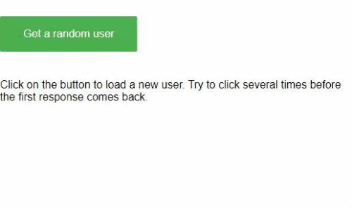

# Angular Loading Indicator application

In order to provide a really nice user experience, An Angular application does quite a lot of things behind the scene in an asynchronous manner, such as HTTP requests to perform some operations on the handled resources. The browser does not show that the current route is loading or that a REST call is issued, as in standard websites. If the remote call is long to be processed, the natural behaviour of an impatient user would be to click everywhere to check that the application is not blocked... It would of course result in a huge number of remote calls, making the situation even worse!

It would be a nice idea to show to the user that something is being processed behind the scene and try to make him more patient. That's where the loading indicator comes into play.

## Architecture

We need only a few elements to achieve that goal:

- an HTTP interceptor providing a way to centralize the incrementing and decrementing of the REST calls
- a service responsible for holding the loading indicator state
- a component showing the loading indicator

## HTTP interceptor

All HTTP requests are intercepted in order to instruct the service to start the indicator before issuing the request and stop the indicator after receiving the response.

```typescript
@Injectable({
  providedIn: 'root'
})
export class LoadingIndicatorInterceptor implements HttpInterceptor {

  constructor(private readonly loadingIndicatorService: LoadingIndicatorService) {
  }

  intercept(req: HttpRequest<any>, next: HttpHandler): Observable<HttpEvent<any>> {
    // Start the loading indicator
    this.loadingIndicatorService.start();

    // Return the original request
    return next.handle(req)
      // Stops the loading indicator when the HTTP call get cancelled, completes or throws an error
      .pipe(finalize(() => this.loadingIndicatorService.stop()));
  }

}
```

As every interceptor, it must be defined in `app.module.ts` file in the providers section. This one should be in the first position.

## Service

The service basically holds a counter of on-going tasks and exposes an Observable emitting the status of the loading indicator as a boolean (are there on-going tasks?).

```typescript
@Injectable({
  providedIn: 'root'
})
export class LoadingIndicatorService {
  // Counter of on-going tasks
  private loading = 0;

  // Subject to emit the state of the loading indicator. By default there is no on-going task
  private readonly _loading$: Subject<boolean> = new BehaviorSubject<boolean>(false);

  // Observable to expose the state of the loading indicator. The value is emitted only when it changes.
  readonly loading$: Observable<boolean> = this._loading$.pipe(
    distinctUntilChanged(),
    delay(0)
  );

  /**
   * Start a loading task (e.g. when a new server connection is started)
   */
  start() {
    this.loading++;
    this.emit();
  }

  /**
   * Stop a loading task (e.g. when a server connection has been finished)
   */
  stop() {
    if (this.loading > 0) {
      this.loading--;
      this.emit();
    }
  }

  /**
   * Emit the loading state
   */
  private emit() {
    this._loading$.next(this.isLoading());
  }

  /**
   * Return the loading state
   */
  private isLoading(): boolean {
    return this.loading > 0;
  }
}
```

## Component

The component show the loading indicator to the user based on its status (given by the service via the Observable).

```typescript
export class LoadingIndicatorComponent {

  constructor(private readonly loadingIndicatorService: LoadingIndicatorService) { }

  get loading$() {
    return this.loadingIndicatorService.loading$;
  }

}
```

This implementation of the HTML part of the component is over simple, but the beauty of the UI is not the goal in this example. Of course, it could be replaced by a nice Material spinner.

```html
<span *ngIf="loading$ | async">Loading...</span>
```

## Code example

An example of a (really simple) working application can be browsed here: https://github.com/ocanzillon/angular-loading-indicator

